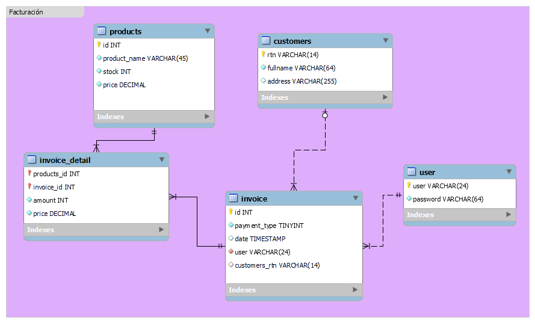

# ITGRAHN Invoice App

   
   

✨ Aplicacion Web de Facturación.

## ⚡️ Descripción
Aplicación web para gestión de productos, clientes y facturacion con ReactJS. Realizada como prueba técnica para puesto de desarrollador.

## ⚡️ Diagrama ER
El diagrama ER de las entidades y relaciones existentes en el sistema de facturación:

## ✍🏻 Getting Started
Antes de iniciar, debe tener:
1. Nodejs: Instalar Nodejs (+18)

## 🚀 Setup
> Project Configuration.
1. Clonar este proyecto: `git clone https://github.com/chrisjosuedev/itgrahn-app.git`
2. Navegar al directorio del proyecto: `cd itgrahn-app`

## 🛠 Run
1. Instalar de módulos de node: `npm install`
2. Ejecutar la applicación: `npm run dev`

## 🦀 Technologies

